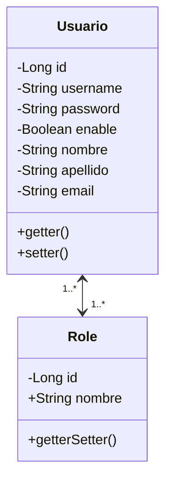
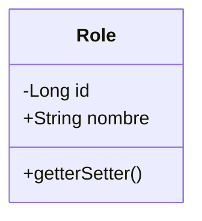
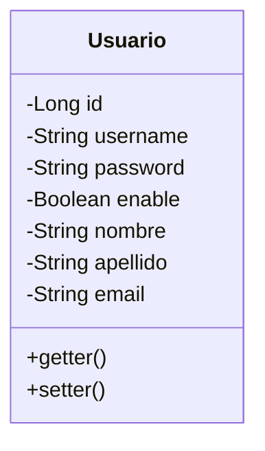

# Usuario y Roles

Todos los sistemas tienen su modulo de **usuarios** que gestiona la información de las personas que interactuan con el aplicativo. Información como el username, password, nombre, entro otros. Un usuario puede tener varios permisos, y estos permisos se pueden agrupar, y la mejor forma de hacerlo es por medio de **roles**. Por lo tanto, se va tener una relación entre **usuario** y **role**. Un usuario puede tener uno o varios roles, y un role puede estar asignado en varios usarios. 

Se crea la clase Role de tipo Entity. A continuación el diagrama de clases. Es una relación de muchos a muchos bidireccional entre **Usuario** y **Role** 

## 1. Crear entity Role

## 2. Crear entity Usuario

Se crea la clase Usuario de tipo Entity

### 2.1 Atributos

### 2.2 Getter y Setter

## 3. Insert de usuario y roles

En el archivo import.sql se adiciona los scripts para insertar roles, usuarios, usuarios y roles. Esto a que es una relación muchos a muchos

